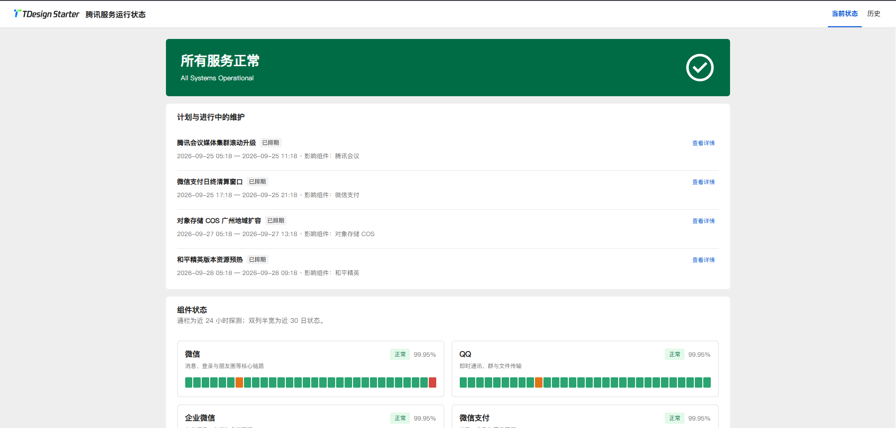

<p align="center">
  <a href="https://tdesign.tencent.com/" target="_blank">
    
  </a>
</p>

<p align="center">
  <a href="https://nodejs.org/en/about/releases/"></a>
  <a href="./LICENSE">
    
  </a>
</p>

简体中文 | [English](./README.md)

> 本仓库为 **TDesign 社区项目**，**并非**腾讯 TDesign 官方团队开发、维护或背书的产品！

### 简介

**TDesign Status** 是基于 TDesign 组件库开发的自托管的状态页，涵盖了公开状态页、故障与维护历史，以及管理中台。

技术栈：前端 `Vue 3` + `Vite` + `Pinia` + `TDesign`，后端 `Fastify` + `SQLite`（`better-sqlite3` / Drizzle）。



### 特性

- 公开状态页：包含进行中的维护、组件状态、维护历史
- 自适应移动端布局
- 继承 TDesign 的主题模式
- 轻量化单进程：API + 静态 SPA
- 免费 PaaS 部署（Render / Koyeb）；见 [DEPLOY.md](./DEPLOY.md)

### 环境要求

- Node.js `>=20.19.0 <25`（ESLint 10 等工具链更偏好 20.19+、22.13+ 或 24+）
- 构建需能编译 `better-sqlite3`（本机需 Python + C++ 工具链）

### 快速开始

```bash
cp .env.example .env
# 填写 STATUS_ADMIN_USERNAME / STATUS_ADMIN_PASSWORD

npm install
npm run db:migrate
npm run db:seed
npm run dev
```

- 应用 / API（开发）：`http://127.0.0.1:3000`（以 `.env` 为准）
- Vite 前端（开发）：通常 `http://127.0.0.1:3002`
- 就绪接口：`GET /api/health/live`

### 部署

推荐使用 **Render**（Blueprint + `render.yaml`）或 **Koyeb**（`Dockerfile`）作为云托管。

但也允许直接 Docker 部署：

```bash
docker build -t tdesign-status .
docker run --rm -p 3000:3000 \
  -e STATUS_ADMIN_USERNAME=admin \
  -e STATUS_ADMIN_PASSWORD='change-me-1234567' \
  -e STATUS_ADMIN_MUST_CHANGE=false \
  -e STATUS_AUTO_SEED=true \
  -e STATUS_TRUST_PROXY=true \
  tdesign-status
```

### 环境变量

| 变量 | 描述 |
|------|------|
| `STATUS_ADMIN_*` | 管理员 |
| `STATUS_DB_PATH` | SQLite 路径 |
| `PORT` / `STATUS_PORT` | 监听端口 |
| `STATUS_HOST` | 监听地址 |
| `STATUS_AUTO_SEED` | 自动填充模拟数据 |
| `STATUS_TRUST_PROXY` | 反代 HTTPS 时设为 `true` |

### 浏览器兼容

| Edge | Firefox | Chrome | Safari |
|------|---------|--------|--------|
| >=84 | >=83 | >=84 | >=14.1 |

### 开源协议

MIT，见 [LICENSE](./LICENSE)。上游 TDesign 相关内容仍遵循其各自协议。
